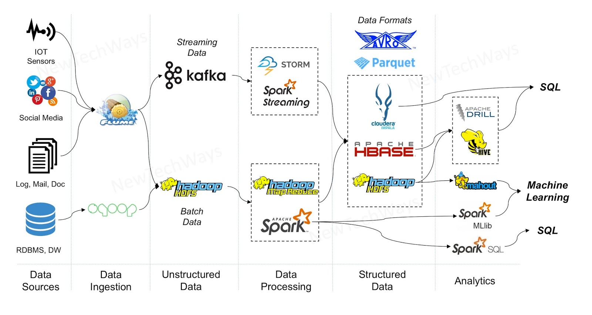
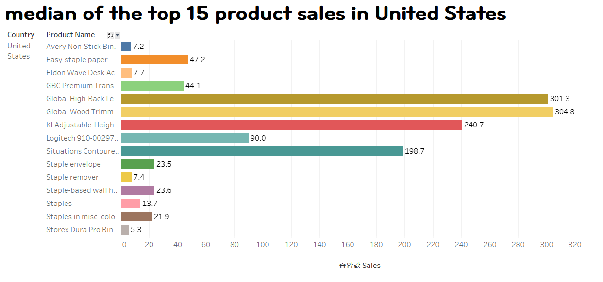

# 분산 처리 교육 과정 - 미니 프로젝트

**Contributor**

- 김동훈 김형우 변지영 정희택 정지현

---

# 0.1 Data Description

[superstore.csv](distributed/superstore.csv)

| Column | Data type | Description |
| --- | --- | --- |
| Row ID | INT | 행 번호 |
| Order ID | STRING | 주문 ID |
| Order Date | STRING | 주문일 |
| Ship Date | STRING | 선박 화물적재일 |
| Ship Mode | STRING | 선박 화물적재구역 |
| Customer ID | STRING | 구매자 ID |
| Customer Name | STRING | 구매자 이름 |
| Segment | STRING | 구매자 유형 |
| Country | STRING | 국가 |
| City | STRING | 도시 |
| State | STRING | 주 |
| Postal Code | FLOAT | 우편 번호 |
| Region | STRING | 지역 |
| Product ID | STRING | 상품 ID |
| Category | STRING | 품목 |
| Sub-Category | STRING | 세부 품목 |
| Product Name | STRING | 상품명 |
| Sales  | FLOAT | 상품 가격 ($)  |

## 0.2 DevTool & Enviroment

|  | Solution & Programs | Usage |
| --- | --- | --- |
|  | MariaDB | Manage Data |
|  | Apache Sqoop | Collect & Load Data |
|  | Apache Pig | Preprocess Data |
|  | Apache Hive | Load & Preprocess Data |
|  | Tableau | Visualization  |
|  | kafka | Collect Data |
|  | Oracle VM Virtualbox | OS Container |

### 0.3 Eco-System Pipline



▲ 예시

## 1. Data Collection (희택, 지영)

[superstore_sales.csv](distributed/superstore_sales.csv)

- SOURCE -

    [https://www.kaggle.com/datasets/rohitsahoo/sales-forecasting](https://www.kaggle.com/datasets/rohitsahoo/sales-forecasting)

- **1.1. Load Data To DB, DB To HDFS**

    ```sql
    # 미니 프로젝트를 위한 경로 생성
    mkdir ~/mini
    cd ~/mini
    hdfs dfs -mkdir mini
    
    # db 접속 ~ 생성
    mysql --user=student --password=student
    create database mini;
    
    # mini database로 이동
    use mini;
    
    # superstore 테이블 생성
    create table superstore(
        row_id int primary key, 
        order_id varchar(500), 
        order_date varchar(500), 
        ship_date varchar(500), 
        ship_mode varchar(500), 
        customer_id varchar(500), 
        customer_name varchar(500), 
        segment varchar(500), 
        country varchar(500), 
        city varchar(500), 
        state varchar(500), 
        postal_code float, 
        region varchar(500), 
        product_id varchar(500), 
        category varchar(500), 
        sub_category varchar(500), 
        product_name varchar(500), 
        sales float
        );
    quit;
    
    # copy file
    cp superstore_sales.csv superstore.csv
    vi superstore.csv
    
    # remove ^M(carriage return)
    # in vim
    %s/\r//g
    
    # remove ,,, also in vim
    %s/,,,//g
    
    # remove first row(column names)
    1d
    
    # load local file to db (mysql 실행해서 해야합니다.)
    load data local infile 'superstore.csv' into table superstore fields terminated by ',' enclosed by '\"' lines terminated by '\n';
    
    # import from db to hdfs
    sqoop import \
    --connect jdbc:mysql://localhost/mini \
    --username student --password student \
    --table superstore --fields-terminated-by ',' \
    --target-dir /mini/superstore
    ```

- **1.2. Put CSV file(Local) into HDFS**

    ```bash
    hdfs dfs -mkdir /mini/original
    hdfs dfs -put ~/mini/superstore_sales.csv /mini/original
    
    hdfs dfs -ls /mini/original
    ```

- **1.3. Create Table using Hive and Load data**

    ```sql
    # Hue에서 Create Table
    CREATE TABLE store(
     row_id INT,
     order_id STRING,
     order_date STRING,
     ship_date STRING,
     ship_mode STRING,
     customer_id STRING,
     customer_name STRING,
     segment STRING,
     country STRING,
     city STRING,
     state STRING,
     postal_code FLOAT,
     region STRING,
     product_id STRING,
     category STRING,
     sub_category STRING,
     product_name STRING,
     sales FLOAT
    )
    ROW FORMAT DELIMITED
    FIELDS TERMINATED BY ',';
    
    ```

    ```bash
    hdfs dfs -mkdir /mini/store
    hdfs dfs -cp /mini/superstore/part* /mini/store/
    ```

    ```sql
    # Load Data
    LOAD DATA INPATH '/mini/store/part*' INTO TABLE store;
    ```

## 2. Data Preprocessing (형우, 동훈, 지현)

1. Drop or Process NULL value

    ```sql
    # centos shell
    hdfs dfs -mkdir /mini/for_preproc
    hdfs dfs -cp /mini/superstore/part* /mini/for_preproc
    
    # execute grunt
    pig
    
    # grunt shell
    data = LOAD '/mini/for_preproc/part*' using PigStorage(',') AS (row_id:int,
                   order_id:chararray,
                   order_date:chararray,
                   ship_date:chararray,
                   ship_mode:chararray,
                   customer_id:chararray,
                   customer_name:chararray,
                   segment:chararray,
                   country:chararray,
                   city:chararray,
                   state:chararray,
                   postal_code:float,
                   region:chararray,
                   product_id:chararray,
                   category:chararray,
                   sub_category:chararray,
                   product_name:chararray,
                   sales:float
    );
    
    not_null = FILTER data BY row_id is not NULL 
     AND order_id is not NULL 
     AND order_date is not NULL
     AND ship_date is not NULL 
     AND ship_mode is not NULL 
     AND customer_id is not NULL
     AND customer_name is not NULL 
     AND segment is not NULL 
     AND country is not NULL
     AND city is not NULL 
     AND state is not NULL 
     AND postal_code is not NULL
     AND region is not NULL 
     AND product_id is not NULL 
     AND category is not NULL
     AND sub_category is not NULL 
     AND product_name is not NULL 
     AND sales is not NULL;
    
    reordered = order not_null by row_id;
    
    STORE reordered INTO '/mini/preprocessed';
    DUMP reordered;
    
    category_f = filter not_null by category == 'Furniture';
    category_of = filter not_null by category == 'Office Supplies';
    category_t = filter not_null by category == 'Technology';
    
    store category_f into '/mini/store_partitioned/furniture';
    store category_of into '/mini/store_partitioned/office';
    store category_t into '/mini/store_partitioned/technology';
    ```

## 3. Data Loading (희택, 지영)

### 3.1. Load To HDFS

- Partition By Product category (category)

```sql
CREATE TABLE store_partitioned (
 row_id INT,
 order_id STRING,
 order_date STRING,
 ship_date STRING,
 ship_mode STRING,
 customer_id STRING,
 customer_name STRING,
 segment STRING,
 country STRING,
 city STRING,
 state STRING,
 postal_code FLOAT,
 region STRING,
 product_id STRING,
 category STRING,
 sub_category STRING,
 product_name STRING,
 sales FLOAT
)
PARTITIONED BY (category string)
ROW FORMAT DELIMITED FIELDS TERMINATED BY '\t'
LOCATION '/mini/store_partitioned'
```

```sql
ALTER TABLE store_partitioned ADD PARTITION(category='Furniture');

ALTER TABLE store_partitioned ADD PARTITION(category='Office Supplies');

ALTER TABLE store_partitioned ADD PARTITION(category='Technology');

load data inpath '/mini/store_partitioned/furniture' into table ads partition(category='Furniture');

load data inpath '/mini/store_partitioned/office' into table ads partition(category='Office Supplies');

load data inpath '/mini/store_partitioned/technology' into table ads partition(category='Technology');
```

### 3.2. Load To Database

```sql
# db 접속 ~ 생성
mysql --user=student --password=student

use mini;

# superstore_partitioned 테이블 생성
create table superstore_partitioned(
    row_id int primary key, 
    order_id varchar(500), 
    order_date varchar(500), 
    ship_date varchar(500), 
    ship_mode varchar(500), 
    customer_id varchar(500), 
    customer_name varchar(500), 
    segment varchar(500), 
    country varchar(500), 
    city varchar(500), 
    state varchar(500), 
    postal_code float, 
    region varchar(500), 
    product_id varchar(500), 
    category varchar(500), 
    sub_category varchar(500), 
    product_name varchar(500), 
    sales float
    );
quit;

sqoop export \
--connect jdbc:mysql://localhost/mini \
--username student --password student \
--table superstore_partitioned --fields-terminated-by ',' \
--export-dir /mini/store_partitioned
```

Tableau 를 사용한 시각화




